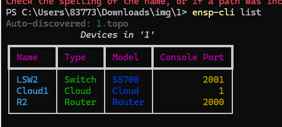
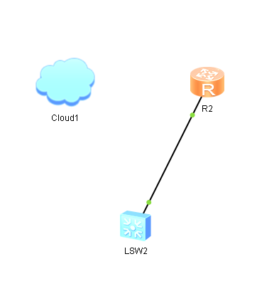
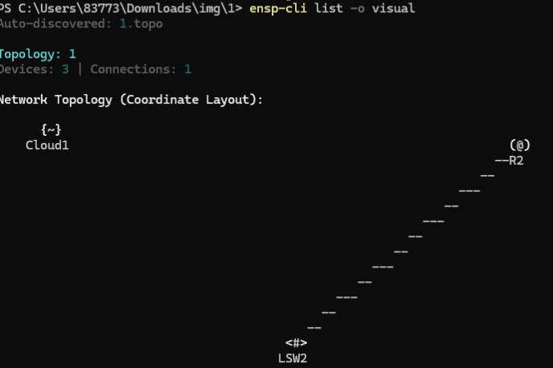
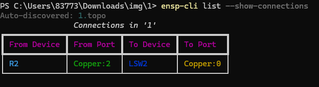
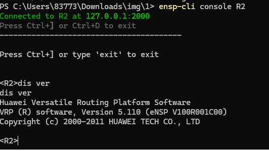
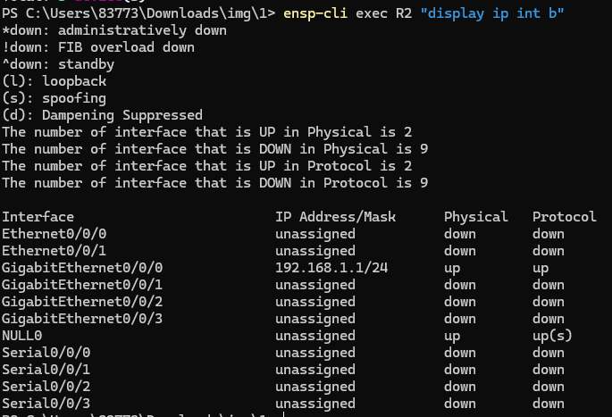

# eNSP CLI

QQ group:808488619

A CLI tool for managing eNSP (Enterprise Network Simulation Platform) topology files and device connections.

## Features

- **Topology Parsing**: Parse eNSP topology files (.topo) with device and connection info
- **Visual Topology**: ASCII art topology diagram based on device coordinates
- **Device Management**: List devices, view connections, auto-discover topology files
- **Interactive Console**: Connect to devices via Telnet for interactive sessions
- **Command Execution**: Execute single commands on devices with output capture
- **Rich Output**: Table, JSON, and visual output formats with syntax highlighting
- **Exit Codes**: Proper exit codes for scripting and automation

## Installation

```bash
pip install ensp-cli
```

Or install from source:

```bash
git clone https://github.com/yourusername/ensp-cli.git
cd ensp-cli
pip install -e .
```

## Requirements

- Python 3.10+
- eNSP installed and running (Windows)
- Telnet enabled on eNSP devices

## Usage

### List Devices




```bash
# Auto-discover topology file in current directory
ensp-cli list

# Specify topology file
ensp-cli list topology.topo

# Show connections
ensp-cli list --show-connections

# Visual topology diagram
ensp-cli list --output visual

# JSON output
ensp-cli list --output json
```

### Interactive Console

```bash
# Connect to a device interactively
ensp-cli console Router1

# Specify topology file
ensp-cli console Router1 --topology mylab.topo

# Exit with Ctrl+] or Ctrl+D
```

### Execute Commands

```bash
# Execute a single command
ensp-cli exec Router1 "display version"

# With timeout
ensp-cli exec Router1 "display ip interface brief" --timeout 30

# JSON output for scripting
ensp-cli exec Router1 "display version" --output json
```

## Exit Codes

| Code | Meaning |
|------|---------|
| 0 | Success |
| 1 | General error (device not found, connection failed) |
| 2 | File not found |
| 3 | Invalid XML / Parse error |
| 4 | Permission denied |
| 5 | Command timeout |

## Development

```bash
# Install dev dependencies
pip install -e ".[dev]"

# Run tests
pytest

# Run with coverage
pytest --cov=ensp_cli
```

## Project Structure

```
ensp-cli/
├── src/ensp_cli/
│   ├── cli/main.py          # Main CLI entry point
│   ├── commands/            # exec, console commands
│   ├── models/              # Device, Topology, Connection models
│   ├── parser/              # XML topology parser
│   └── telnet_client.py     # Async Telnet client
├── tests/                   # Test suite (173 tests)
└── docs/                    # Documentation
```

## License

MIT License

## Changelog

### v1.0.0 (2026-03-30)

- ✅ Parse eNSP `.topo` XML files
- ✅ List devices with table/JSON/visual output
- ✅ Telnet connection to device consoles
- ✅ Interactive console sessions
- ✅ Single command execution
- ✅ Rich terminal UI with syntax highlighting
- ✅ Comprehensive test suite (173 tests)
